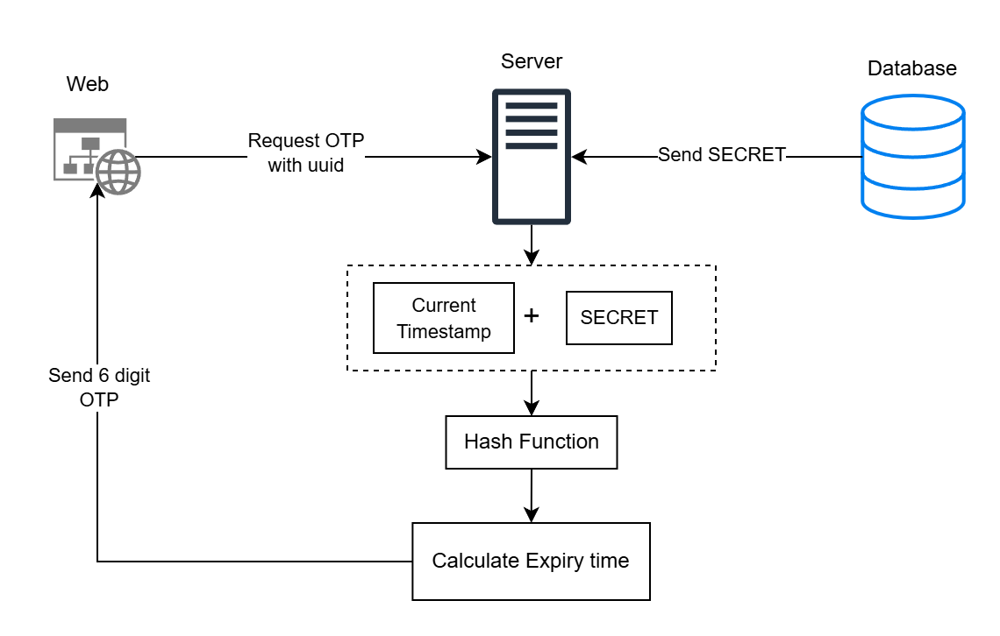
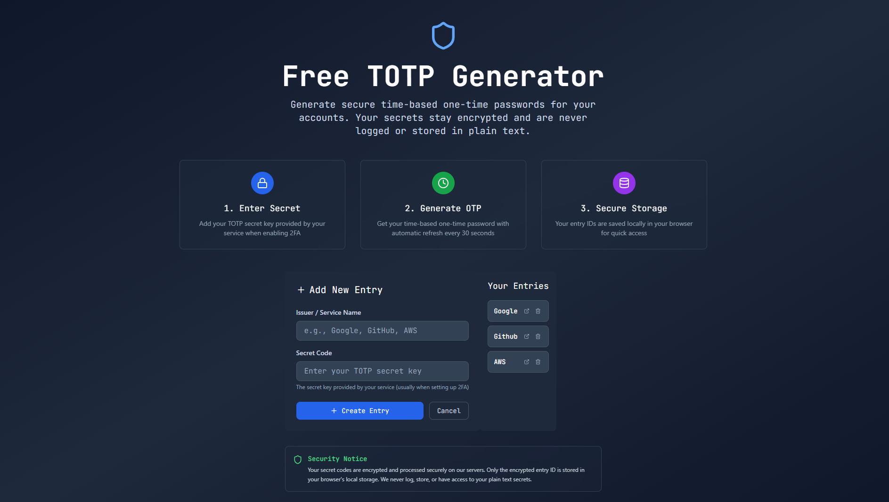
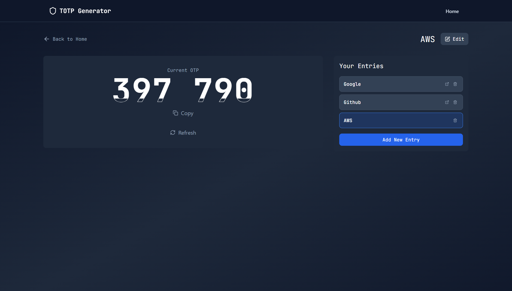

# TOTP Generator

[](https://react.dev/)
[](https://vitejs.dev/) [](https://nodejs.org/) [](https://expressjs.com/) [](https://www.mongodb.com/) [](./LICENSE)

---

A free, minimal **TOTP (Time-based One-Time Password) Generator**.  
This app lets you add and manage secrets, generate secure OTPs, and view them with a sleek timer interface – all stored safely in your browser.

<div align="center" style=" display: flex;">
<figure style="width: 50%;">
  <picture>
    <source media="(prefers-color-scheme: dark)" srcset="assets/diagrams/HLD-dark.png" />
    <source media="(prefers-color-scheme: light)" srcset="assets/diagrams/HLD-light.png" />
    
  </picture>
  <figcaption><p>High Level Design</p></figcaption>
</figure>

<figure style="width: 50%; ">
  <picture>
    <source media="(prefers-color-scheme: dark)" srcset="assets/diagrams/sequence-dark.png" />
    <source media="(prefers-color-scheme: light)" srcset="assets/diagrams/HLD-light.png" />
    
  </picture>
  <figcaption><p>Sequence Diagram</p></figcaption>
</figure>
</div>

## Screenshots

<div align="center" style="margin-top: 10px;margin-bottom: 10px; display: flex; justify-content: center;">

<figure>
  
  <figcaption><p>Homepage</p></figcaption>
</figure>

<figure>
  
  <figcaption><p>Dedicated Otp page</p></figcaption>
</figure>
  </div>

## How It Works

Time-based OTPs (TOTP) are generated using the **HMAC-SHA1 hashing algorithm** combined with the current time.

- The secret key (Base32 encoded) shared between client and server is combined with the current Unix timestamp.
- The timestamp is divided into discrete intervals (typically 30 seconds).
- Using HMAC-SHA1, the secret and this time interval are hashed to generate a numeric code.
- The output is truncated to produce a short 6-digit one-time password.

This approach ensures that the OTP is valid only for the current time window and changes in sync across systems that share the same secret.

## Features

- **Secure OTP Generation** using TOTP algorithm
- **Add new secrets** via form input (QR upload planned for future)
- **OTP Dashboard** with:
  - Current OTP code
  - Countdown timer (auto-refresh on expiry)
  - Minimal timer representation (circular/linear)
- **Manage Entries**:
  - Update issuer/secret securely (secret never exposed in frontend)
  - Delete entries as needed
  - Persistent entry IDs stored in LocalStorage
- **Entry Sidebar**: Quickly switch between saved OTP entries
- **Dark Mode UI** with a clean, readable tech font

---

## Tech Stack

### Backend

- Node.js + Express
- MongoDB (Mongoose)
- TOTP generation + CRUD APIs

### Frontend

- Vite + React
- React Router v6
- TailwindCSS
- LocalStorage for saved IDs

## Contributing

### Prerequisites

- Node.js (>= 18)
- MongoDB

### Fork & Clone

```
git clone https://github.com/<your-username>/totp-generator.git
cd totp-generator
```

### Install Dependencies

```
npm install
```

### Run the app

```
npm run dev
```

### Using Docker for MongoDB

```
cd totp-generator
docker-compose up -d
```

### License

MIT License © 2025 Gadangi Sainag ☺️
